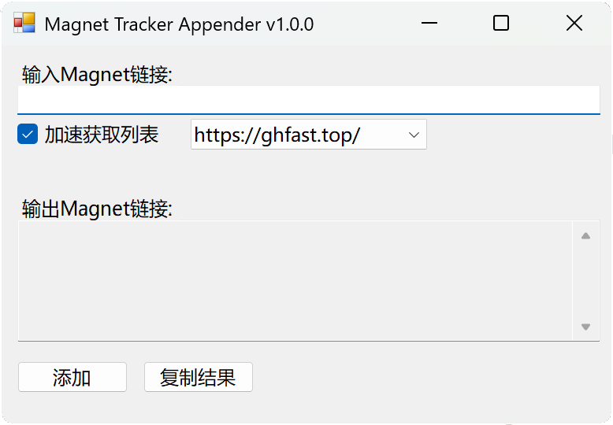

# Magnet Tracker Appender

[](https://github.com/zed76r/magnet-tracker-appender/releases)
[](LICENSE)

一个简单易用的 Magnet 链接 Tracker 追加工具,可以自动为你的 Magnet 链接追加最新的 Tracker 列表,提升 BT 下载速度。



## ✨ 特性

- 🚀 **自动添加 Tracker** - 自动从 [ngosang/trackerslist](https://github.com/ngosang/trackerslist) 获取最新的高质量 Tracker 列表
- 🌐 **加速获取** - 支持多个 GitHub 加速镜像站,国内用户也能快速获取
- 🎨 **图形化界面** - 基于 Windows Forms 的友好界面,简单直观
- 📋 **一键复制** - 处理完成后一键复制结果到剪贴板
- ⚙️ **自定义加速** - 支持自定义加速地址

## 📥 下载安装

### 方式一: 下载编译好的 EXE (推荐)

直接从 [Releases](https://github.com/zed76r/magnet-tracker-appender/releases/latest) 页面下载最新版本的 `MagnetTrackerAppender.exe`,双击运行即可。

### 方式二: 运行 PowerShell 脚本

如果你更喜欢使用脚本:

1. 下载 `add_tracker.ps1` 文件
2. 右键点击文件,选择 "使用 PowerShell 运行"
3. 如果提示执行策略错误,请以管理员身份运行 PowerShell 并执行:
   ```powershell
   Set-ExecutionPolicy -ExecutionPolicy RemoteSigned -Scope CurrentUser
   ```

## 📖 使用方法

1. **输入 Magnet 链接** - 在顶部文本框中粘贴你的 Magnet 链接
2. **选择加速选项**(可选) - 如果需要加速获取 Tracker 列表,勾选"加速获取列表"并选择一个加速镜像
3. **点击添加按钮** - 点击"添加 Tracker"按钮开始处理
4. **复制结果** - 处理完成后,点击"复制结果"按钮将新的 Magnet 链接复制到剪贴板
5. **使用新链接** - 将新的 Magnet 链接粘贴到你的 BT 下载工具中

## 🔧 从源码编译

### 前置要求

- Windows 操作系统
- PowerShell 5.0 或更高版本
- [ps2exe](https://github.com/MScholtes/PS2EXE) 工具(用于编译成 EXE)

### 编译步骤

1. 克隆仓库:
   ```bash
   git clone https://github.com/zed76r/magnet-tracker-appender.git
   cd magnet-tracker-appender
   ```

2. 安装 ps2exe:
   ```powershell
   Install-Module ps2exe -Scope CurrentUser
   ```

3. 编译成 EXE:
   ```powershell
   Invoke-ps2exe -inputFile .\add_tracker.ps1 -outputFile .\MagnetTrackerAppender.exe -title "Magnet Tracker Appender" -version "1.0.0" -company "Your Name" -noConsole -requireAdmin
   ```

## 🌐 加速镜像列表

项目内置了以下 GitHub 加速镜像:

- https://ghfast.top/
- https://gh.llkk.cc/
- https://gh.qninq.cn/
- https://ghproxy.cfd/

你也可以选择"自定义..."选项来使用自己的加速地址。

## 📝 Tracker 来源

本工具使用的 Tracker 列表来自 [ngosang/trackerslist](https://github.com/ngosang/trackerslist) 项目,该项目定期更新维护高质量的公共 Tracker 列表。

## 🤝 贡献

欢迎提交 Issue 和 Pull Request!

## 📄 许可证

本项目采用 [MIT 许可证](LICENSE)。

## ⚠️ 免责声明

本工具仅用于为 Magnet 链接添加公共 Tracker,请遵守当地法律法规,不要用于下载侵权或违法内容。

## 🙏 致谢

- [ngosang/trackerslist](https://github.com/ngosang/trackerslist) - 提供高质量的 Tracker 列表
- [MScholtes/PS2EXE](https://github.com/MScholtes/PS2EXE) - PowerShell 转 EXE 工具

---

如果这个项目对你有帮助,请给个 ⭐️ Star 支持一下!
